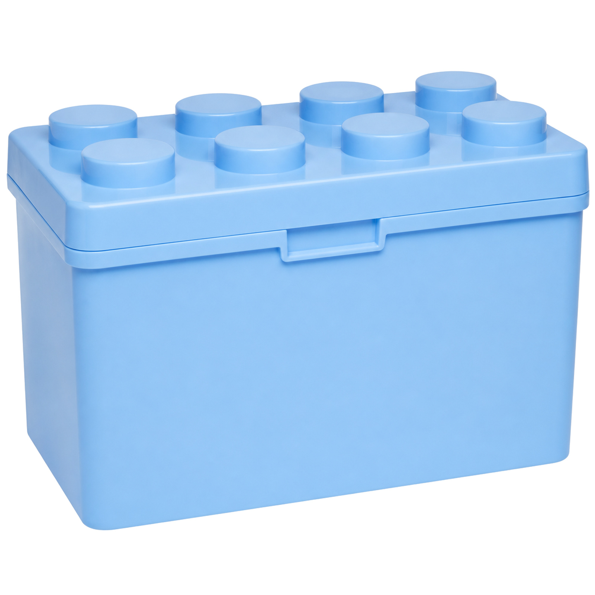
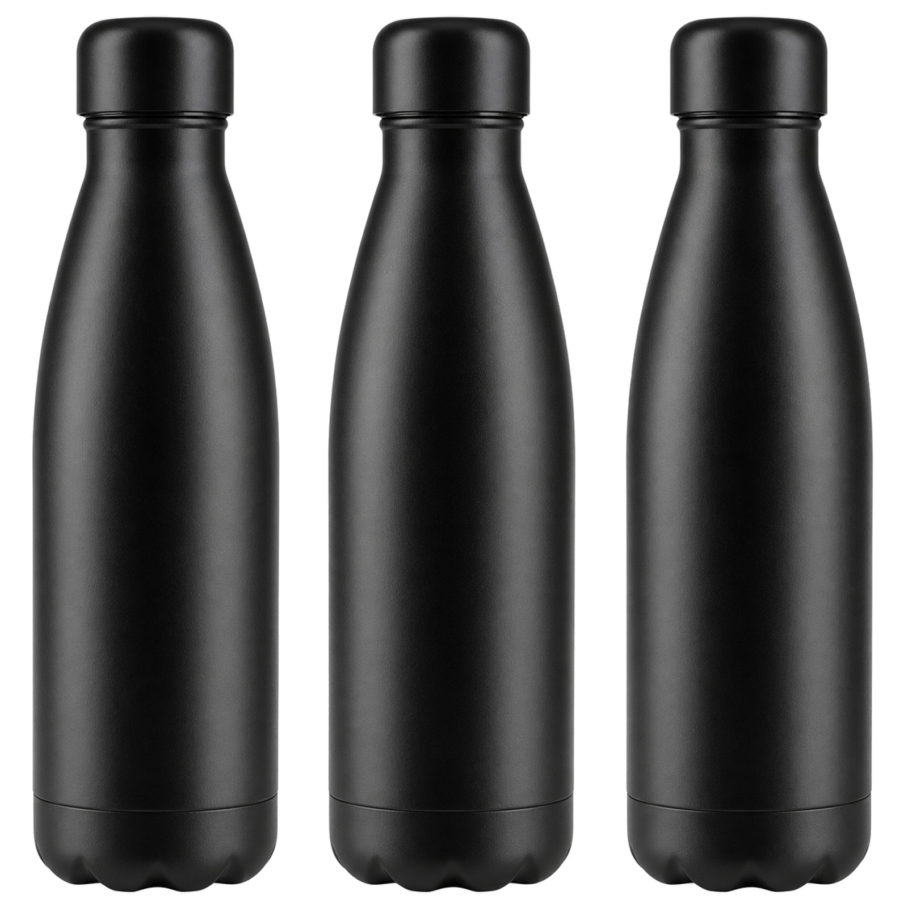

# 🏭 SSB Listing Studio

**Turn a single product-database row into an Amazon-A+-compliant, _physically-consistent_ listing — then recompose it into multipacks and combos just by chatting.**

A multi-agent pipeline (LangGraph + FastAPI) that does the tedious, error-prone part of e-commerce operations end to end: pull the product, enrich it from the open web _with citations_, generate compliant copy and imagery, and **verify the generated image actually matches the data** (right unit count, right colour, right proportions) before it ships.

<p>


</p>

> 🔴 **Live demo:** [shop-lnrf.onrender.com](https://shop-lnrf.onrender.com) &nbsp;·&nbsp; API docs at [`/docs`](https://shop-lnrf.onrender.com/docs)
> _(free tier — the first request after idle takes ~50s to cold-start, then it's snappy.)_

---

## ✨ See it in one glance

The same product, generated as a **single unit**, a **3-pack**, and a **combo with another SKU** — the image is regenerated each time so the picture never lies about what's in the box:

| Single | 3-pack (recomposed by chat) | A + B combo (recomposed by chat) |
|:--:|:--:|:--:|
|  |  |  |
| 1 unit · white-bg hero | **3 units in frame** · weight ×3 + packaging recomputed | **both products in one frame** · merged specs |

More sample outputs (heroes, A+ modules, and the full listing JSON) live in [`samples/`](samples/).

---

## 🤔 Why this is interesting

Most "AI product listing" demos are a single prompt that spits out text. The genuinely hard parts — the ones this project is built around — are:

- **Physical consistency.** If the database says the pack has 3 blue bottles, the generated image must show *3 blue bottles*. This is enforced by a **Critic agent** that runs deterministic pixel checks (white-background, product coverage, object count, **and an aspect-ratio check against the product's real dimensions**) plus a 3-sample majority-vote vision verification — and bounces the job back to the image agent on failure.
- **Real multi-agent orchestration**, not a mega-prompt. A LangGraph supervisor coordinates distinct Copy / Marketing / Image / Critic / A+ / Compliance / Research nodes, passes shared state along, and drives a retry loop. Every run emits a **reviewable trace** over SSE.
- **No hallucinated specs.** Enrichment only injects **HIGH-confidence, source-cited** facts into the copy; unverifiable claims are kept out and flagged, so citations from the web genuinely shape the listing.
- **Compliance you can trust.** A deterministic, zero-model validator gates the listing against the Amazon A+ ruleset (title/bullets length & banned words, backend search terms ≤250 bytes, main-image format, A+ module sizes + alt text).

---

## 🧩 Features

- 🔌 **Bring-your-own product DB** — point `DATABASE_URL` at a **read-only** Postgres or MySQL; the schema is introspected and mapped to a normalized shape by synonyms (combined fields like `30×20×15 cm` and mixed weight units are parsed defensively). No DB? A built-in 3-SKU mock boots instantly.
- 🌐 **Web enrichment with citations** — Tavily-backed research fills category norms, specs, and buyer keywords, each with a source URL, a confidence score, and explicit handling of missing/conflicting data.
- 🤖 **Multi-agent generation** — Supervisor → Physical → Copy → Marketing → Image → Critic → A+ → Compliance, orchestrated in LangGraph.
- 🖼️ **Spec-faithful imagery** — white-background hero (JPEG, ≥1600px, background snapped to exactly RGB 255,255,255) plus A+ modules at exact sizes (970×600, 970×300) with alt text.
- 💬 **Conversational recompose** — `"make it a 3-pack"` → `"now combine it with SSB-002"`; multi-turn, LLM-driven intent (not a regex state machine), with imagery **and** copy **and** physics all recomputed.
- 🔢 **Deterministic physics** — total weight, packaging, and package dimensions are recomputed **in code**, not guessed by the model, with the assumptions returned for transparency.
- ✅ **Compliance validator (B1)**, 📊 **cost & observability** (per-agent timing, tokens, image count, estimated USD), 🧬 **variant + pricing suggestions (B3)**, 👀 **human review gate + diff (B4)**, 📈 **eval harness (B5)**.
- 🐳 **One-command Docker**, boots even with zero keys (degraded modes return clear notes instead of failing).

---

## 🏗️ How it works

```
              ┌───────────────────────── FastAPI ─────────────────────────┐
              │ /products /product /enrich /listing /chat                  │
              │ /trace(SSE) /jobs /compliance /eval /review /diff /variants│
              └───────────────────────────┬───────────────────────────────┘
                                          │ spec { kind, skus[], units }
             ┌────────────────────────────▼────────────────────────────┐
             │        LangGraph orchestration (Supervisor + nodes)      │
             │                                                          │
             │  supervisor → physical → copy → marketing → image        │
             │                                          → critic         │
             │                              (fail, ≤2 retries) ↺ image   │
             │              (pass) → aplus → compliance → END            │
             └───────────────────────────┬──────────────────────────────┘
                                         │ tools
   ┌─────────────────────────────────────┼──────────────────────────────────┐
   │ llm (chat + vision)   imagegen (gpt-image-2)   research (Tavily)        │
   │ physical.repack       compliance   metrics     db (introspect / mock)   │
   └────────────────────────────────────────────────────────────────────────┘
```

| Agent | Responsibility |
|---|---|
| **Supervisor** | plans the run, loads products, drives the Critic retry decision |
| **Physical** | recomputes total weight, packaging & dimensions deterministically |
| **Copy** | A+ title (brand-led, no promo), 5 benefit bullets, backend search terms; weaves in source-cited facts |
| **Marketing** | scores copy on benefit-clarity / keyword-coverage / appeal and rewrites weak copy **within compliance** |
| **Image** | white-bg hero + multipack count / combo same-frame renders |
| **Critic / QA** | image-vs-spec consistency: white-bg pixels, coverage, aspect-ratio vs real dims, count, 3-vote vision |
| **A+** | builds 970×600 + 970×300 modules (image + headline + body + alt text) |
| **Compliance** | deterministic A+ rule validator over copy + images |
| **Research** | web enrichment with cited sources, confidence, conflicts; mines buyer keywords |

Read [REPORT.md](REPORT.md) for the design rationale, prompt-iteration history, and the validation record.

---

## 🚀 Quick start

```bash
git clone https://github.com/Corn-web3/shop.git
cd shop
cp .env.example .env          # optional — fill in LLM / image / Tavily / DATABASE_URL

# Docker (one command)
docker compose up --build     # → http://localhost:8000  (docs at /docs)

# …or run locally
pip install -r requirements.txt
uvicorn app.main:app --reload --port 8000
```

**No keys?** It still boots: the built-in 3-SKU mock DB is used, copy/critic/research fall back to offline modes, and images are synthesized placeholders. Every key-dependent endpoint returns a clear note instead of erroring.

### Try it

```bash
# generate a listing (returns a job_id)
curl -X POST http://localhost:8000/listing/SSB-003?units=1

# watch the agents work, live
curl -N http://localhost:8000/trace/<job_id>

# recompose by chat
curl -X POST http://localhost:8000/chat \
  -H 'content-type: application/json' \
  -d '{"session_id":"s1","message":"make SSB-001 a 3-pack"}'
```

---

## 🔗 Endpoints

| Method & path | What it does |
|---|---|
| `GET /health` | status + active DB source + which keys are configured |
| `GET /products` · `GET /product/{sku}` | normalized product records |
| `POST /enrich/{sku}` | **web enrichment**: cited fields + confidence + conflicts/missing |
| `POST /listing/{sku}?units=N` | **multi-agent generation** → `job_id` |
| `GET /trace/{job_id}` (SSE) · `GET /jobs/{job_id}` | reviewable agent trace / final listing |
| `POST /chat` | **conversational recompose** (multipack / combo, multi-turn) |
| `POST /compliance` | copy/image compliance validator |
| `POST /eval` | quality + physical-consistency scoring over SKUs |
| `POST /review/{job_id}` · `GET /diff?base=&recomposed=` | review gate + original-vs-recomposed diff |
| `GET /variants/{sku}` | parent/child variants + pricing suggestion |

---

## 🔬 Two guarantees, up close

**A+ compliance is deterministic.** [`app/compliance.py`](app/compliance.py) makes zero model calls and runs as a graph node that gates the listing's `compliant` flag: title present / ≤200 chars / brand-leading / no banned promo phrases; ≤5 bullets, each ≤500 chars, no contact info; backend search terms ≤250 **bytes**; A+ modules each carry an image + alt text at a standard size; main image is JPEG < 10MB. Reproducible and free.

**Physical consistency is checked in two layers** ([`app/physical.py`](app/physical.py) + the Critic):
1. **Deterministic pixel checks** — corner-sampled white background, longest-side coverage ≥85%, object count by column projection, and an aspect-ratio comparison of the on-screen bounding box against the product's two largest real dimensions (a 7×7×25 cm bottle should photograph tall ≈3.6:1).
2. **Vision verification (3-sample majority vote)** — the model judges the image against the claimed count, colour, and material; for combos it confirms each distinct item is present. On failure the Supervisor returns the job to the Image agent (≤2 attempts).

---

## 🧱 Tech stack

**FastAPI** · **LangGraph** (multi-agent orchestration) · **OpenAI-compatible** chat + vision + image APIs (any gateway via `.env`) · **Tavily** (web search) · **Pillow** (pixel checks / placeholder synthesis) · **psycopg / PyMySQL** (read-only introspection) · **Docker**.

## 🗂️ Project layout

```
app/
  main.py            FastAPI app + endpoints
  graph.py           LangGraph orchestration
  agents/            copy, marketing, image, critic, aplus, research, intent
  tools/             llm, imagegen, research
  physical.py        deterministic weight/packaging/dimension recompute
  compliance.py      deterministic A+ rule validator
  db_*.py            schema introspection (Postgres / MySQL) + mock
samples/             example listings (JSON + images) incl. multipack & combo
scripts/             offline acceptance harness (zero API cost)
```

---

## 🗺️ Roadmap

- Auto-correct retry loop when compliance fails (today it reports + gates)
- Real infographic A+ modules (rendered data callouts) beyond photo modules
- Segmentation-based object counting instead of column projection
- Per-call real cost capture when the gateway returns pricing; auth + rate limiting

## 🤝 Contributing

Issues and PRs welcome. The acceptance harness runs entirely offline and is the definition of done:

```bash
PYTHONPATH=. python scripts/check_acceptance.py   # zero API cost
```

## 📜 License

MIT — see [LICENSE](LICENSE).

## 🙏 Origin

This project began as a take-home challenge for an AI product-engineering role; the original brief is preserved in [CHALLENGE.md](CHALLENGE.md). It has since been built out as a standalone reference implementation of agentic, compliance-aware, physically-grounded content generation.

---

<p align="center"><i>If this saved you from writing a listing by hand, drop a ⭐ — it helps.</i></p>
